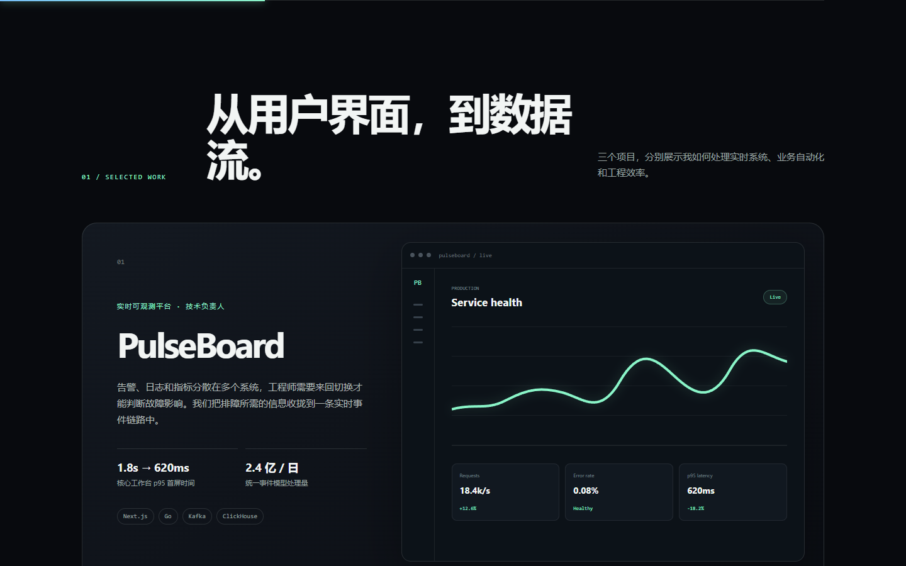
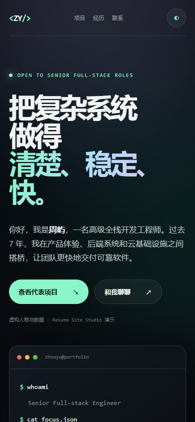
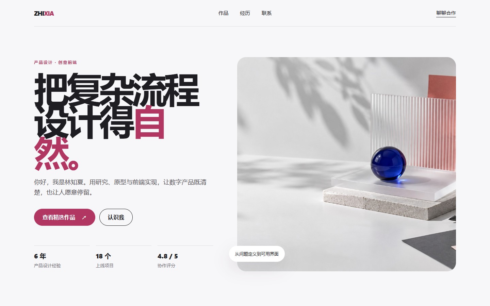
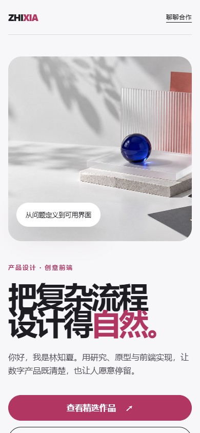
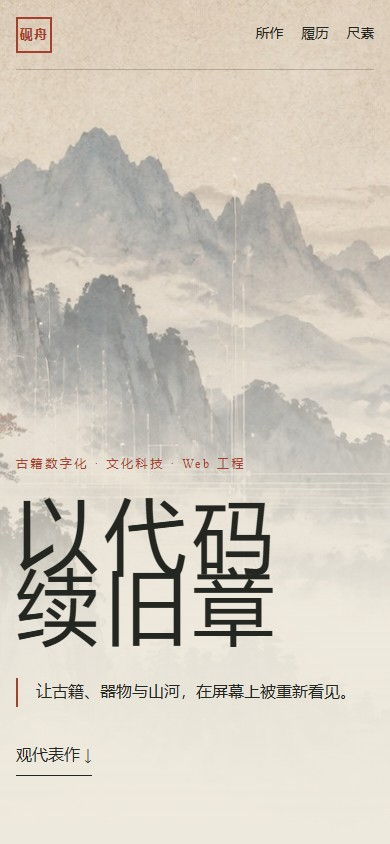

# Resume Site Studio 简历网站案例库

这是使用 [`resume-site-studio`](https://github.com/magicjacky/resume-site-studio) Skill 制作的三个虚构示例。人物、公司、学校、项目和指标均为演示数据，不对应真实个人或组织。

三个案例共用一个 GitHub Pages 站点，但拥有不同的信息结构、视觉语言和响应式布局。

## 案例目录

| 案例 | 定位 | 视觉方向 | 在线预览 |
| --- | --- | --- | --- |
| 周屿 | 高级全栈开发工程师 | 深色技术感、终端语言、数据可视化 | [打开案例](https://magicjacky.github.io/resume-site-studio-demo/) |
| 林知夏 | 产品设计师与创意前端 | 冷白编辑感、莓粉点缀、柔和材质 | [打开案例](https://magicjacky.github.io/resume-site-studio-demo/elegant/) |
| 沈砚舟 | 数字文化工程师 | 宣纸水墨、朱砂印记、卷章结构 | [打开案例](https://magicjacky.github.io/resume-site-studio-demo/guofeng/) |

## 案例一：全栈开发工程师

强调复杂系统、交付能力和可量化的工程成果，适合开发、平台工程和技术负责人。

[在线预览](https://magicjacky.github.io/resume-site-studio-demo/)


<details>
<summary>查看更多截图</summary>



<p align="center">
  
</p>
</details>

## 案例二：产品设计师

以冷白工作室、莓粉单色点缀和编辑式排版呈现研究、产品设计与前端实现能力。原创主视觉由 GPT Image 生成。

[在线预览](https://magicjacky.github.io/resume-site-studio-demo/elegant/)



<p align="center">
  
</p>

## 案例三：古风数字文化工程师

以宣纸、水墨和朱砂构成页面秩序，将古籍数字化、文化科技和全栈工程放进卷章式叙事。原创水墨主视觉由 GPT Image 生成。

[在线预览](https://magicjacky.github.io/resume-site-studio-demo/guofeng/)


<p align="center">
  
</p>

## 本地预览

在 `public` 目录运行：

```powershell
python -m http.server 8788 --bind 127.0.0.1
```

然后访问：

- 全栈开发工程师：<http://127.0.0.1:8788/>
- 产品设计师：<http://127.0.0.1:8788/elegant/>
- 古风数字文化工程师：<http://127.0.0.1:8788/guofeng/>

## 目录结构

```text
public/
├── index.html              # 全栈开发工程师
├── styles.css
├── app.js
├── elegant/                # 产品设计师
└── guofeng/                # 古风数字文化工程师
docs/screenshots/           # README 展示截图
```

每个案例都使用语义化 HTML、响应式 CSS、键盘焦点样式、减少动态效果适配和无 JavaScript 可读内容。

## 修改成真实简历

修改对应案例目录中的 `index.html` 即可。发布前逐项核对姓名、公司、日期、项目角色、指标和联系方式，并从公开目录移除不希望公开的信息。真实简历和提取后的内部资料不要提交到公开仓库。

## 许可

本项目采用 [PolyForm Noncommercial License 1.0.0](LICENSE)：

- 允许个人学习、研究、测试和其他非商业用途；
- 允许在非商业用途下修改和再分发；
- 再分发原版或修改版时，必须保留许可证和 Required Notice；
- 未经书面授权不得用于商业用途，授权方式见 [COMMERCIAL_USE.md](COMMERCIAL_USE.md)。

这是一份源码可见许可，不属于 OSI 定义下的开源许可证。
